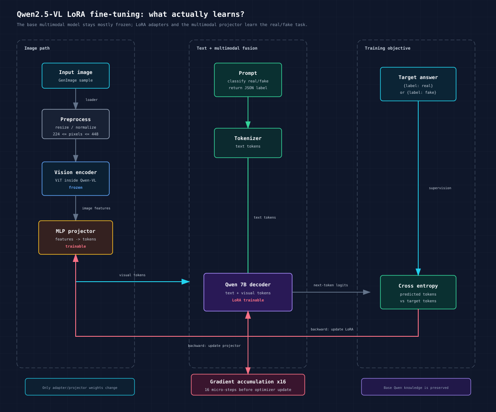

# Qwen2.5-VL LoRA Fine-Tuning Architecture

Tài liệu này giải thích **cách pipeline fine-tuning đang vận hành** và **bên trong model đang học cái gì**. Mục tiêu không phải đọc code, mà là giúp mình hình dung được toàn bộ cơ chế: ảnh đi vào đâu, label được dùng như thế nào, LoRA cập nhật phần nào, và sau train thì eval/report chạy ra sao.



## 1. Mình đang fine-tune cái gì?

Model nền là:

```text
Qwen/Qwen2.5-VL-7B-Instruct
```

Đây là model vision-language, tức là nó nhận được cả:

- ảnh;
- text prompt;
- rồi sinh text output.

Trong bài toán của mình, text output được ép rất đơn giản:

```json
{"label":"real"}
```

hoặc:

```json
{"label":"fake"}
```

Nói ngắn gọn: mình đang biến Qwen2.5-VL thành một classifier real/fake, nhưng vẫn dùng cơ chế sinh text của nó.

## 2. Vì sao không full fine-tune?

Full fine-tune nghĩa là cập nhật rất nhiều hoặc toàn bộ trọng số của Qwen 7B. Cách đó tốn GPU, dễ OOM, checkpoint lớn, và dễ làm model mất năng lực nền.

Mình dùng **LoRA**.

LoRA là cách gắn thêm các ma trận nhỏ vào model. Khi train, mình chủ yếu cập nhật các phần nhỏ này thay vì đụng toàn bộ model gốc.

Hình dung đơn giản:

```text
Qwen 7B gốc     gần như giữ nguyên
LoRA adapter    được train
Projector       được train
Vision encoder  frozen
```

Vì vậy artifact cuối cùng không phải full model 7B mới, mà là:

```text
base Qwen2.5-VL-7B + LoRA adapter
```

## 3. Ảnh đi qua model như thế nào?

Luồng chính:

```text
Ảnh GenImage
  ↓
Data loader
  ↓
Resize / normalize
  ↓
Vision encoder, tức ViT trong Qwen-VL
  ↓
Image features
  ↓
MLP projector
  ↓
Visual tokens
  ↓
Qwen 7B decoder
  ↓
JSON label output
```

Trong đó:

- **Vision encoder / ViT**: đọc ảnh và biến ảnh thành feature.
- **MLP projector**: biến image feature thành visual tokens mà Qwen 7B hiểu được.
- **Qwen 7B decoder**: nhận text tokens + visual tokens rồi sinh câu trả lời.

Điểm quan trọng: với cấu hình hiện tại, vision encoder được giữ frozen. Phần học chính là projector và LoRA trong Qwen decoder.

## 4. Text prompt làm gì?

Mỗi ảnh được ghép với một prompt cố định:

```text
You are an image-forensics classifier.
Classify the image as either "real" or "fake".
Return exactly one JSON object with one key: label.
The label must be "real" or "fake".
```

Prompt này có vai trò định nghĩa task. Model không được yêu cầu giải thích, không được yêu cầu confidence, chỉ cần sinh label.

Lý do mình bỏ `evidence` và `confidence` ở giai đoạn này:

- mục tiêu chính là cải thiện phân loại real/fake;
- evidence từ dataset label không phải bằng chứng forensic thật;
- confidence nếu gán cứng có thể làm model học calibration giả;
- output càng đơn giản thì parse càng ổn, metric càng sạch.

## 5. Training sample trông như thế nào?

Mỗi dòng train là một conversation:

```json
{
  "image": "/vol/data/protocol-a-small/train/imagenet_glide/ai/example.png",
  "conversations": [
    {
      "from": "human",
      "value": "<image>\nYou are an image-forensics classifier. Classify the image as either \"real\" or \"fake\". Return exactly one JSON object with one key: label. The label must be \"real\" or \"fake\"."
    },
    {
      "from": "gpt",
      "value": "{\"label\":\"fake\"}"
    }
  ]
}
```

Nếu ảnh nằm trong thư mục GenImage `ai`, label là `fake`.

Nếu ảnh nằm trong thư mục GenImage `nature`, label là `real`.

## 6. Loss được tính như thế nào?

Qwen vẫn là model sinh text. Khi train, nó không trực tiếp học kiểu classifier head truyền thống. Nó học bằng cách dự đoán token của câu trả lời đúng.

Ví dụ target là:

```json
{"label":"fake"}
```

Model sinh ra phân phối xác suất cho từng token. Cross-entropy so sánh token model dự đoán với token target.

Luồng học:

```text
Visual tokens + text prompt
  ↓
Qwen decoder
  ↓
Predicted output tokens
  ↓
Compare with target JSON label
  ↓
Cross-entropy loss
  ↓
Backward
  ↓
Gradient
  ↓
Update LoRA + projector
```

Nên model đang học: “với loại tín hiệu hình ảnh này, khi prompt hỏi real/fake thì nên sinh JSON label nào”.

## 7. Gradient accumulation x16 là gì?

Batch thật trên GPU hiện tại là:

```text
per_device_train_batch_size = 1
```

Tức mỗi micro-step GPU xử lý 1 ảnh. Sau mỗi ảnh, gradient được giữ lại, chưa update optimizer ngay.

Sau 16 micro-step:

```text
gradient_accumulation_steps = 16
```

optimizer mới cập nhật trọng số một lần.

Hình dung:

```text
ảnh 1  -> loss -> gradient giữ lại
ảnh 2  -> loss -> gradient cộng dồn
...
ảnh 16 -> loss -> gradient cộng dồn
                  ↓
                AdamW update
                  ↓
             reset gradient
```

Mục đích: giữ VRAM thấp như batch size 1, nhưng update ổn định hơn so với update từng ảnh riêng lẻ.

## 8. Resize / max_pixels ảnh hưởng gì?

Qwen-VL không đưa file ảnh gốc nguyên xi vào decoder. Ảnh đi qua processor trước. Processor sẽ resize/chuẩn hóa ảnh rồi biến thành visual tokens.

Cấu hình hiện tại:

```text
min_pixels = 50176    khoảng 224 x 224
max_pixels = 200704   khoảng 448 x 448
```

Điều này không làm thay đổi file ảnh trong dataset. Nó chỉ giới hạn lượng thông tin ảnh đưa vào model trong lúc train/eval.

Trade-off:

```text
max_pixels thấp hơn  -> ít VRAM hơn, chạy ổn hơn, nhưng mất chi tiết nhỏ
max_pixels cao hơn   -> giữ nhiều tín hiệu forensic hơn, nhưng dễ OOM hơn
```

Với forensics, chi tiết nhỏ quan trọng. Vì vậy `448x448` là mức cân bằng ban đầu: cao hơn smoke quá thấp, nhưng vẫn có cơ hội chạy trên A100-40GB.

Điểm quan trọng để so sánh công bằng: train và eval phải dùng cùng `min_pixels/max_pixels`.

## 9. Pipeline dữ liệu vận hành như thế nào?

Mình upload raw GenImage zip lên Modal Volume:

```text
/vol/archives/qwen_ft_protocol_a_small.zip
```

Sau đó chạy bước prepare:

```text
prepare_from_raw_archive
```

Bước này làm:

```text
Raw zip
  ↓
Extract tạm thời trong container
  ↓
Tìm GenImage root
  ↓
Sample ảnh theo protocol
  ↓
Copy subset vào /vol/data/protocol-a-small
  ↓
Tạo train.csv
  ↓
Tạo eval_small.csv
  ↓
Tạo qwen_train_abs.jsonl
  ↓
Tạo qwen_train_split_abs.jsonl + qwen_val_abs.jsonl
```

Vì raw extract nằm trong temp của container, Modal Volume không bị phình lên bằng toàn bộ dataset raw. Volume chủ yếu giữ subset cần dùng.

## 10. Protocol A small là gì?

Protocol hiện tại dùng 7 generator:

```text
BigGAN
VQDM
SD v1.5
Wukong
ADM
GLIDE
Midjourney
```

Mỗi generator lấy:

```text
train: 100 real + 100 fake
eval:   50 real +  50 fake
```

Tổng:

```text
train = 7 x 2 x 100 = 1400 ảnh
eval  = 7 x 2 x 50  = 700 ảnh
```

Đây là tập nhỏ để kiểm tra pipeline và tín hiệu ban đầu. Nó chưa phải kết quả cuối để kết luận khoa học.

## 11. Validation trong Trainer khác Eval-small như thế nào?

Có hai loại đánh giá:

### Validation nội bộ khi train

Từ `qwen_train_abs.jsonl`, code tách khoảng 20% ra:

```text
qwen_train_split_abs.jsonl
qwen_val_abs.jsonl
```

Validation này giúp Trainer theo dõi loss trong lúc train.

### Eval-small của project

Eval-small là tập riêng từ GenImage `val`:

```text
/vol/data/protocol-a-small/manifests/eval_small.csv
```

Eval-small mới là thứ dùng để sinh:

```text
predictions.jsonl
metrics.json
metrics_by_source.csv
report.md
```

Nói ngắn gọn:

```text
Trainer validation  -> theo dõi quá trình học
Project eval-small  -> đo kết quả bằng metric của project
```

## 12. Sau train artifact là gì?

Sau khi train xong, mình cần folder:

```text
/vol/checkpoints/protocol-a-small/final_adapter
```

Trong đó cần có:

```text
adapter_config.json
adapter_model.safetensors
training_meta.json
```

Đây là phần LoRA adapter. Khi eval, mình không dùng adapter một mình. Mình load:

```text
Qwen2.5-VL-7B base model
  +
final_adapter
```

Rồi mới chạy inference.

## 13. Eval sau fine-tune hoạt động như thế nào?

Luồng eval:

```text
eval_small.csv
  ↓
Load image
  ↓
Check checksum
  ↓
Load base Qwen2.5-VL
  ↓
Load LoRA final_adapter
  ↓
Apply same min_pixels/max_pixels
  ↓
Prompt real/fake
  ↓
Generate JSON label
  ↓
Parse output
  ↓
Write predictions.jsonl
  ↓
Compute metrics
  ↓
Write report
```

Nếu output là JSON sạch:

```json
{"label":"fake"}
```

thì `parse_status = parsed`.

Nếu model sinh thêm chữ nhưng vẫn có JSON bên trong, parser cố recover:

```text
parse_status = recovered
```

Nếu không lấy được label:

```text
label_pred = unknown
parse_status = failed
```

## 14. Mình đọc metric thế nào?

Với bài toán này, không chỉ nhìn accuracy.

Nên nhìn theo thứ tự:

```text
balanced_accuracy
fake recall
real recall
precision
f1
parse failure rate
metric theo từng generator
```

Vì baseline zero-shot Qwen trước đó yếu ở fake recall, câu hỏi chính sau fine-tuning là:

```text
Fine-tuning có giúp model bắt fake tốt hơn không?
```

Nhưng cũng phải kiểm tra:

```text
Nó có làm real recall tụt mạnh không?
```

Nếu fake recall tăng nhưng real bị đánh nhầm quá nhiều thành fake, model có thể chỉ đang bias sang fake.

## 15. Tại sao cần metrics_by_source.csv?

Metric tổng có thể che lỗi theo generator.

Ví dụ:

```text
BigGAN tốt
GLIDE tốt
Midjourney rất tệ
```

Nếu chỉ nhìn metric tổng, mình không biết model học được tín hiệu tổng quát hay chỉ hợp với vài generator.

`metrics_by_source.csv` giúp đọc:

```text
generator nào cải thiện
generator nào tụt
generator nào gây false positive/false negative nhiều
```

Đây là file rất quan trọng trước khi chạy full hoặc Protocol B.

## 16. Seen / unseen sẽ dùng để kiểm tra gì?

Protocol A small train và eval đều dùng 7 generator. Nó trả lời:

```text
Nếu model đã thấy các generator này trong train, nó có cải thiện trên val không?
```

Protocol B seen/unseen sẽ trả lời câu quan trọng hơn:

```text
Model có học dấu hiệu forensic tổng quát không,
hay chỉ học shortcut của generator đã thấy?
```

Ý tưởng Protocol B:

```text
Train seen generators:
BigGAN, VQDM, ADM, GLIDE

Eval unseen generators:
SD v1.5, Wukong, Midjourney
```

Nếu Protocol A tốt nhưng Protocol B kém, model có thể đang học generator-specific pattern.

## 17. Lệnh vận hành chính

Chuẩn bị data từ raw zip:

```bash
python3 -m modal run infra/modal/qwen_ft_modal.py --action prepare_from_raw_archive
```

Train LoRA:

```bash
python3 -m modal run infra/modal/qwen_ft_modal.py --action train_lora
```

Nếu còn OOM, giảm pixel:

```bash
python3 -m modal run infra/modal/qwen_ft_modal.py \
  --action train_lora \
  --max-pixels 112896 \
  --min-pixels 50176
```

Nếu LoRA vẫn OOM, thử QLoRA:

```bash
python3 -m modal run infra/modal/qwen_ft_modal.py \
  --action train_lora \
  --method qlora
```

Kiểm tra adapter:

```bash
python3 -m modal volume ls aiforensics-qwen-ft /checkpoints/protocol-a-small/final_adapter
```

Eval-small:

```bash
python3 -m modal run infra/modal/qwen_ft_modal.py --action eval_small
```

Tải kết quả:

```bash
python3 -m modal volume get aiforensics-qwen-ft \
  /eval/protocol-a-small/eval-small \
  ~/aiforensics-modal-results/eval-small
```

## 18. Cốt lõi cần nhớ

Toàn bộ hệ thống có thể hiểu bằng một câu:

```text
Mình lấy ảnh GenImage, biến ảnh thành visual tokens, ghép với prompt real/fake,
cho Qwen sinh JSON label, rồi dùng cross-entropy để cập nhật LoRA adapter
và projector sao cho model sinh label đúng hơn.
```

Hay dạng rút gọn:

```text
Image
  -> ViT frozen
  -> Projector trainable
  -> Visual tokens
  +  Text prompt
  -> Qwen 7B + LoRA trainable
  -> JSON label
  -> Cross-entropy loss
  -> Backward
  -> Accumulate x16
  -> AdamW update
  -> repeat
```

Kết quả cuối không phải một model mới hoàn toàn. Kết quả cuối là một adapter nhỏ giúp Qwen2.5-VL trả lời tốt hơn cho task real/fake trong protocol của mình.
